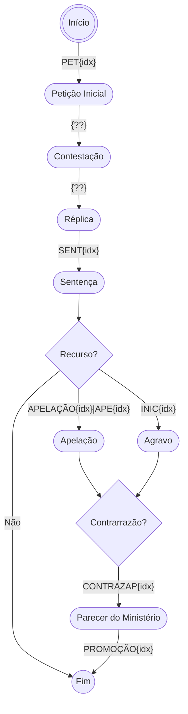

# Proposta Comercial – Automação de Processos Judiciais

## Objetivo
Implementar uma solução de automação para gestão de processos judiciais, focada em classificação, organização, resumos automáticos e análise inteligente de peças processuais, conforme detalhado na estrutura e funcionalidades propostas.

## Estrutura dos Processos
### Tipos de Recursos
#### Apelação
##### <small>Nomenclatura dos arquivos das Peças Processuais:</small>
1. PET\<idx\> - Petição inicial
2. ??? - Contestação
3. ??? - Réplica
4. SENT\<idx\> - Sentença
5. APELAÇÃO\<idx\> | APE\<idx\> - Petição inicial da Apelação
6. CONTRAZAP\<idx\> - Contrarrazão
7. PROMOÇÃO\<idx\> - Parecer do Ministério Público
#### Agravo de Instrumento
##### <small>Nomenclatura dos arquivos das Peças Processuais:</small>
1. PET\<idx\> - Petição inicial
2. ??? - Contestação
3. ??? - Réplica
4. SENT\<idx\> - Sentença
5. INIC\<idx\> - Petição inicial do agravo
6. CONTRAZAP\<idx\> - Contrarrazão
7. PROMOÇÃO\<idx\> - Parecer do Ministério

### Fases do processo (Eventos)

### Duvidas
1. Sobre localizadores:
  1.1 Qualquer funcionário pode criar um localizador?
  1.2 Qual a regra para que sejam criados?
  1.3 Podemos criar localizadores específicos para o projeto?
  1.4 Um processo pode estar em mais de 1 localizador ao mesmo tempo?

## Funcionalidades

### <small>Resumos Inteligentes em lembretes</small>
Uma rotina diária irá passar por todos os processos:
1. Verificando se existe um **Lembrete** com um resumo de cada um dos arquivos anexados.
2. Se algum arquivo não possuir um lembrete
  2.1 O robo irá baixar o arquivo
  2.2 Criar um resumo curto e conciso utilizando um LLM
  2.3 Anexar esse resumo como um **Lembrete**

> Obs.: Podemos limitar essa rotina aos arquivos mais "importantes" caso necessário.

### <small>Classificação Automática de Processos</small>
Um rotina diária irá passar por todos os processos analisando as peças mais recentes e/ou importantes utilizando um LLM. Essa rotina irá classificar os processos em 2 grupos:
1. Duração do caso
 1.1 Mais de 60 dias
 1.2 Mais de 90 dias
 1.3 Mais de 120 dias
2. Complexidade do caso
 2.1 Simples
 2.2 Moderado
 2.3 Complexo

> Caso não seja possível a criação de localizadores, essa classificação pode ser feita por pastas locais no computador de cada usuário ou dentro do próprio sistema.

## LLM (Inteligência Artificial)
Para funções de OCR (conversão de PDF em texto puro) e; análise e classificação das peças podemos utilizar duas abordagens de LLMs que garantam uma melhor privacidade:
1. Um modelo pequeno rodando localmente no computador do funcionário (Isso depende do Hardware das maquina)
2. Um modelo médio hospedado em algum servidor privado.

## Ferramentas
O sistema será desenvolvido com ferramentas modernas e atualizadas, garantindo assim uma paridade tecnológica com o mercado.
1. Python 3.13 - como linguagem de programação principal.
  1.1 Playwright 1.55 - como framework de interação com o website: https://eproc2g.tjsc.jus.br
  1.2 TKInter (Tcl/Tk 9.0) - como framework de Interface Gráfica
2. Ollama + Illa 3.1 8B - como modelo LLM

## Etapas
1. Levantamento de requisitos detalhado. (~10 horas)
2. Prototipação. (~30 horas)
3. Validação Implantação. (~4horas)
4. Treinamento e suporte. (a definir)
